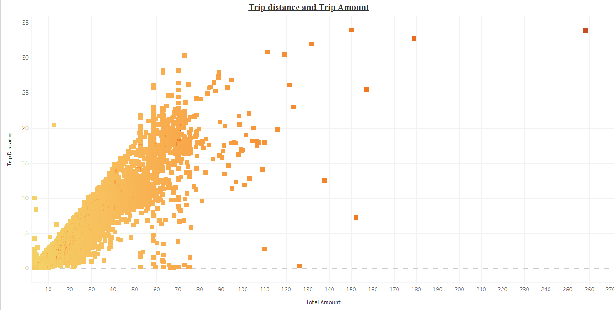
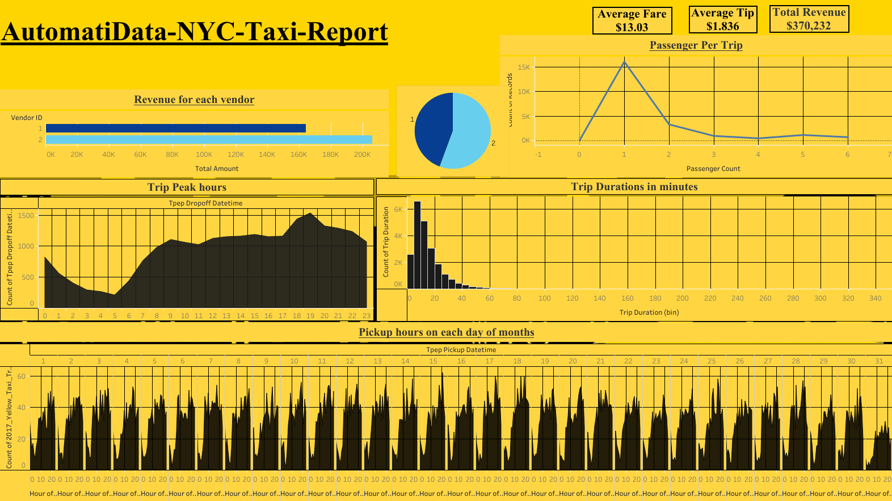

# NYC Yellow Taxi Data Analysis

## Project Overview

This repository contains a step-by-step analysis of the **New York City Yellow Taxi dataset** using **Python**. The goal is to explore the data, perform cleaning, visualize key metrics, and gain insights into trip durations, fare distributions, peak hours, and more.

## Table of Contents

1. [Project Overview](#project-overview)
2. [Dataset](#dataset)
3. [Prerequisites](#prerequisites)
4. [Installation](#installation)
5. [Step-by-Step Analysis](#step-by-step-analysis)
6. [Visualizations](#visualizations)
7. [Project Structure](#project-structure)
8. [Contributing](#contributing)
9. [License](#license)
10. [Acknowledgements](#acknowledgements)

## Dataset

The **New York City Yellow Taxi** dataset includes information such as:

- Pickup and dropoff locations (latitude and longitude)
- Trip duration and distance
- Fare amounts and tips
- Passenger counts
- Payment types

### Data Source

The dataset can be downloaded from the [NYC Taxi &amp; Limousine Commission (TLC) website](https://www.nyc.gov/site/tlc/about/tlc-trip-record-data.page).

# Tableau Visualizations

### 1. Trip Distance and Trip Amount Analysis

This Tableau dashboard provides a scatter plot visualization of the relationship between **trip distance** and **total trip amount** for yellow taxi rides in New York City. It aims to explore how trip distances correlate with the total amount charged for each ride, providing insights into fare structures and distance-based pricing trends.



### Insights:

* The plot demonstrates that as the **trip distance** increases, the **total amount** tends to increase, suggesting a positive correlation between the two variables.
* Most trips cluster around shorter distances and lower total amounts, which may represent common city routes.
* Outliers in the data can be identified as rides with longer distances but disproportionately higher total amounts, potentially indicating special circumstances like heavy traffic, additional charges, or long-distance fares.

### 2. Dashboard:



## Prerequisites

Before you begin, ensure you have met the following requirements:

- Python 3.7 or higher
- Jupyter Notebook (optional, for running the provided notebook)
- Libraries: `pandas`, `matplotlib`, `seaborn`, `numpy`, `plotly`, `geopandas`, `folium`, `sklearn`

## Installation

Clone the repository and install the required Python libraries:

```bash
git clone https://github.com/yourusername/nyc-yellow-taxi-analysis.git
cd nyc-yellow-taxi-analysis
pip install -r requirements.txt
```

## Contributing

If you would like to contribute to this project, feel free to fork the repository and submit a pull request. Contributions are welcome!

---

## License

This project is licensed under the MIT License - see the [LICENSE](LICENSE) file for details.

---

## Acknowledgements

- [NYC Taxi &amp; Limousine Commission (TLC)](https://www.nyc.gov/site/tlc/about/tlc-trip-record-data.page) for providing the dataset.
- **Folium**, **Matplotlib**, and **Seaborn** for data visualization tools.
